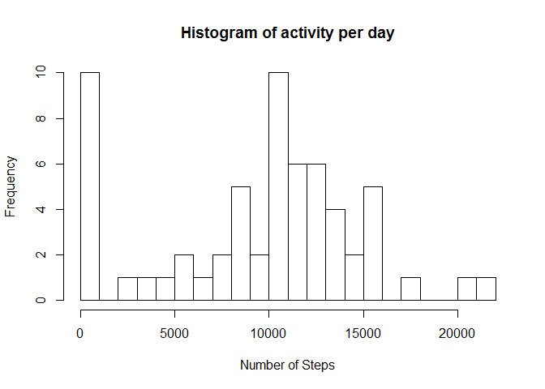
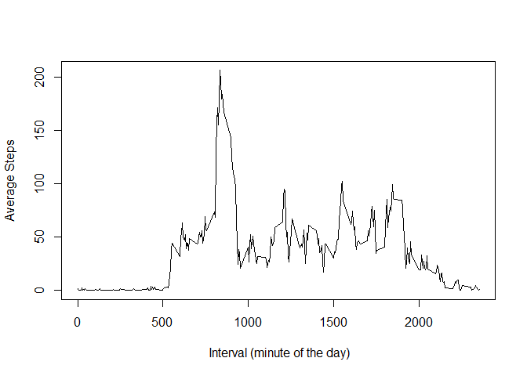
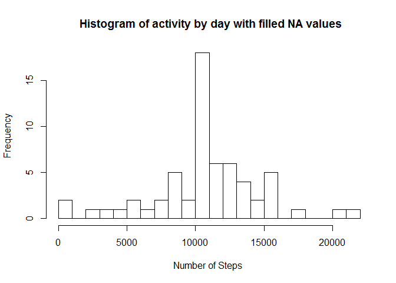
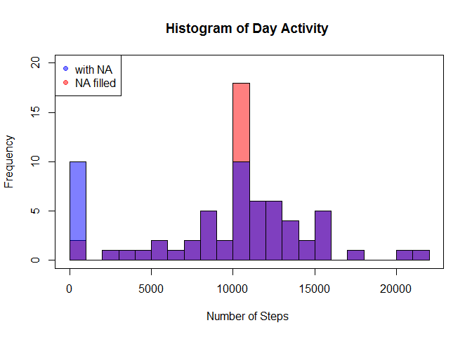
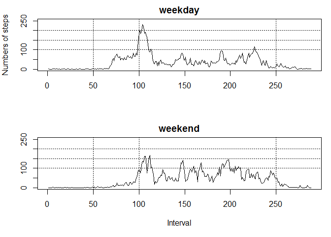

# Reproducible Research: Peer Assessment 1


## Loading and preprocessing the data


```r
#removes all variables from environment
rm(list=ls(all=TRUE)) 
Sys.setlocale("LC_ALL", "C") # US setting 
```

```
## [1] "C"
```

```r
# Load required packages
library(plyr)
library(dplyr)

# Load Data
activity = read.csv("activity.csv")
activity = mutate(activity ,  date  = as.Date(date, "%Y-%m-%d"))
```

## What is mean total number of steps taken per day?


```r
activityDay = tapply(activity$steps, activity$date, sum, na.rm = TRUE)
hist(activityDay, breaks = 20, xlab = "Number of Steps", main = "Histogram of activity per day")
```

 

Mean and median of total number of steps taken per day


```r
mean(activityDay)
```

```
## [1] 9354.23
```

```r
median(activityDay)
```

```
## [1] 10395
```


## What is the average daily activity pattern?


```r
 activityInter =  tapply(activity$steps, activity$interval, mean, na.rm = TRUE)

plot( names(activityInter), activityInter,  type = "l", 
      xlab=" Interval (minute of the day)",
      ylab = "Average Steps")
```

 

5-minute interval which  on average across all the days in the dataset, contains the maximum number of steps


```r
 names(activityInter)[ which.max(activityInter)]
```

```
## [1] "835"
```


## Imputing missing values

Calculation of the total number of missing values in the dataset (i.e. the total number of rows with NAs)


```r
 sum(is.na(activity$steps ) )
```

```
## [1] 2304
```

Missing values assigned based on interval average


```r
activitynoNA = activity                       # New data frame
# df of interval averages
df_activityInter = data.frame(activityInter)  # vector as dataframe
df_activityInter$interval = row.names(df_activityInter)
row.names(df_activityInter) = NULL

activitynoNA = merge(activitynoNA, df_activityInter, by = "interval")

activitynoNA[is.na(activitynoNA$steps), 2] = activitynoNA[is.na(activitynoNA$steps), 4]
```


Histogram of the total number of steps taken each day using data frame with filled NA values.


```r
activityDaynoNA = tapply(activitynoNA$steps, activitynoNA$date, sum)
hist(activityDaynoNA, breaks = 20, xlab = "Number of Steps ", main=" Histogram of activity by day with filled NA values")
```

 


Calculation of mean and median total number of steps taken per day without NA values.

```r
mean(activityDaynoNA)
```

```
## [1] 10766.19
```

```r
median(activityDaynoNA)
```

```
## [1] 10766.19
```

The following chart overlapped the two histograms, to spot main changes of 
  imputing missing data on the estimates of the total daily number of steps. 


```r
# Overlapping histograms
# http://www.r-bloggers.com/overlapping-histogram-in-r/
hist(activityDaynoNA, breaks = 20, xlab = "Number of Steps ", 
     main= "Histogram of Day Activity ",  col = rgb(1,0,0,0.5),
     ylim = c(0,20))
hist(activityDay,  col=rgb(0,0,1,0.5), add=T,breaks = 20)
legend("topleft", c("with NA ", "NA filled"), 
    col = c(rgb(0,0,1,0.5), rgb(1,0,0,0.5)), pch = 19)
box()
```

 

The two  histograms   are  very similar, As  we imputed NA with interval average, it   shifted mean and median  up   a bit.

## Are there differences in activity patterns between weekdays and weekends?


```r
# new factor variable in the dataset DayType with two levels 
# - "weekday" and "weekend" 

activitynoNA = mutate(activitynoNA, weekday = as.POSIXlt(date)$wday)

DayType = function  (x) {
    ifelse ( x > 0 & x < 6,"weekday", "weekend")
}

activitynoNA$DayType = DayType(activitynoNA[,5])

# Draw the plot

activityDayType = tapply(activitynoNA$steps, 
                  list( activitynoNA$DayType , activitynoNA$interval),
                  mean)

par(mfrow = c(2, 1) , mar = c(5, 4, 2, 1)) # c(bottom, left, top, right)
plot(activityDayType[1,], type="l", ylim = c(0,250),  xlab= "", 
     main = "weekday", ylab = "Numbers of steps")
     abline(h=c(100,150,200), lty= 3)
     abline(v=c(50,100,250), lty= 3)
plot(activityDayType[2,], type="l", ylim = c(0,250),  
     main =row.names(activityDayType)[2], 
     xlab = "Interval", ylab = "")
     abline(h=c(100,150,200), lty= 3)
     abline(v=c(50,100,250), lty= 3)
```

 
